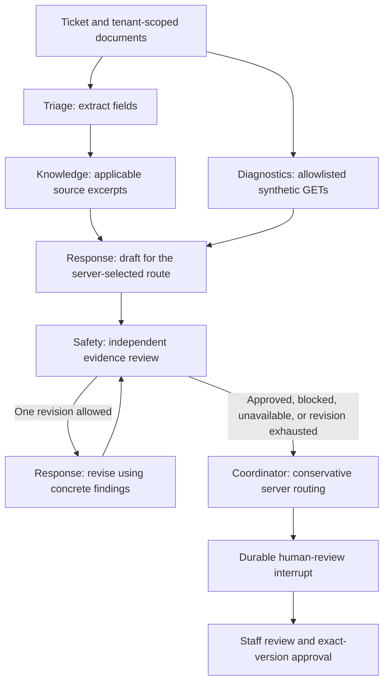

# SupportOps Review Team

An optional evidence-review workflow for an individual support ticket. Choose **Review team** before **Analyze ticket**. Standard analysis remains the default. The report shows each role's findings, applicable sources, review verdict and draft history. Human review and exact-version action approval still apply.

## How the roles cooperate



Triage and diagnostics start in parallel. Response generation waits for both retrieval and diagnostics. Each branch writes separate checkpoint fields. Roles share structured results rather than unrestricted conversations.

| Role | Responsibility | Adapter |
|---|---|---|
| Triage | Extract reported fields, category and unconfirmed hypothesis | Demo rules or configured OpenAI model |
| Knowledge | Filter organization, product and version; return exact source excerpts | Existing hybrid retrieval and embedding adapter |
| Diagnostics | Read service status and recent changes; retain unknown state on failure | Synthetic RetailBridge HTTP API |
| Response | Draft, then optionally revise once from review findings | Demo template or configured OpenAI model |
| Safety | Review the draft against evidence and route; record concrete findings | Mechanical template check in demo; separate structured model call in OpenAI mode |
| Coordinator | Preserve server policy and downgrade unresolved concerns to clarification | Server rules |

OpenAI mode uses separate calls to the same configured model for extraction, drafting and review. These are six responsibilities, not six independently trained models. No role receives model tools or permission to execute writes. The server owns the diagnostic reads and final action lifecycle.

## Routing, evidence and limits

Missing product/version, absent applicable sources, conflicting runbooks, failed diagnostics, or missing incident diagnostics require clarification. A reviewer cannot vote these conditions away. The server also rejects invented bracketed citation IDs and technical drafts with no applicable-source citation. Reviewer findings must quote a literal span of the candidate (or use null for an omission) and reference only supplied evidence IDs. A failed diagnostic record can be cited to explain uncertainty; it cannot establish healthy service and is excluded from supported API facts. These checks establish reference validity, not semantic truth.

A correctable draft defect permits one revision and one final review. If the reviewer is unavailable or the final candidate still fails, the displayed draft is a clearly labelled local clarification template. Rejected candidates remain in review history for staff inspection. Human review is required even when the team reports that checks passed.

- At most five generation attempts per uninterrupted analysis: one extraction, two drafts and two reviews. The common path uses three. Demo makes zero model calls.
- Graph recursion is capped at 20; existing request timeouts and output-token limits apply. Each diagnostic endpoint makes at most two attempts.
- Usage and configured cost estimates aggregate all completed/failed generation attempts with available usage, plus retrieval embeddings. Unknown cost stays null. Provider retries after a crash before a saved checkpoint may add calls/cost outside the recovered ledger; there is no global dollar quota.
- A new analysis after clarification is a separate bounded run. Recovery selects the graph stored on the run, even if the configured default changes.
- Review reports and candidate text are stored with the ticket/checkpoint under existing tenant access rules. The new graph does not emit separate Langfuse role traces; its reports are persisted locally.

## Human feedback and improvement

Staff can attach an optional comment (up to 1,000 characters) to draft acceptance/rejection or action approval/rejection. The audit event records the decision, comment and workflow run; the first review decision is also saved at the graph interrupt. Re-review of an edited proposal produces a new audit decision without rerunning the completed graph.

The dashboard counts saved team runs, unique tickets, concerns by role, revised runs and human decisions within the current organization. CSV exports include the latest workflow mode and review outcome. Counts describe activity; they are not accuracy scores. Comments do not automatically change prompts, model weights, documents or permissions.

For quality work, inspect recorded concerns and feedback, define a specific failure on development examples, make a reviewed change, and evaluate it on a fresh held-out sample. The frozen existing test set must remain untouched. [The development comparison](REVIEW_TEAM_EVALUATION.md) records actual results for both graphs; it does not demonstrate a live-model quality improvement.

## API and configuration

`POST /api/tickets/{id}/analyze` accepts an optional body:

```json
{"workflow_mode": "multi_agent_review"}
```

Use `standard` for the original workflow. Omitting the body preserves backward compatibility. `DEFAULT_WORKFLOW_MODE=standard` controls the default for a ticket's first run. Existing tickets retain their saved mode for recovery and clarification. Migration `0003` adds `workflow_runs.workflow_mode`, marking existing rows as standard while preserving checkpoints and data.

Draft review uses `{"decision":"accepted","reason":"Checked the evidence."}`; action approval/rejection accepts `{"version":1,"reason":"Checked the evidence."}`. Execute continues to accept only the exact action version. The review report is returned in `analysis.review_team`.

## Verification

Tests exercise the graph through mocked Responses API HTTP replies, including one revision, unavailable/invalid review, invented evidence, unknown citations, cost aggregation and parallel execution. API tests cover tenant/role boundaries, diagnostics failures, durable recovery, feedback and dashboard/CSV scoping. Migration and PostgreSQL tests preserve existing standard runs and resume team runs after restart. Playwright exercises the actual UI and backend with synthetic diagnostics.

```powershell
.\.venv\Scripts\python.exe -m pytest -q
.\.venv\Scripts\python.exe scripts/evaluate_review_team.py
.\.venv\Scripts\python.exe scripts/smoke.py --workflow-mode multi_agent_review
```

The smoke command requires a running all-demo stack and creates one synthetic ticket/issue after approval. No live model quality, paid API call or external GitHub write has been validated for this feature.

Implementation references: [LangGraph graph API](https://docs.langchain.com/oss/python/langgraph/graph-api), [LangGraph interrupts](https://docs.langchain.com/oss/python/langgraph/interrupts), and [OpenAI Structured Outputs](https://developers.openai.com/api/docs/guides/structured-outputs). Schema validity does not guarantee factual correctness; evidence checks and human review remain necessary.
